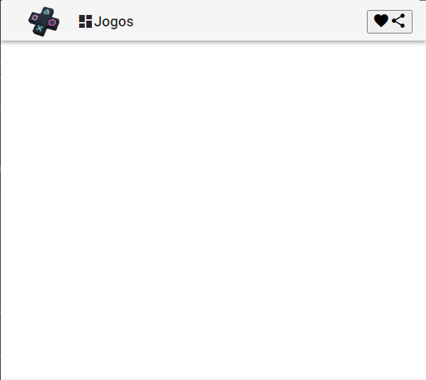

# Desenvolvendo SPA com Angular - spaangular

# Criando um novo projeto - Roteiro

```bash
ng new spaangular --prefix=spa
```

--prefix não é obrigatório, porém todos os componentes que criarmos virão com o prefixo spa, diferenciando esses componentes de outros importados. Você pode escolher o nome do prefixo.

```bash
? Would you like to add Angular routing? Yes		
? Which stylesheet format would you like to use? CSS	
```

Abra a pasta do projeto criado:

```bash
cd spaangular
```

Inicie o vscode:

```bash
code .
```

Inicie o terminal no vscode

Terminal 👉 New Terminal (ou ctrl ➕ shift ➕ ' )

Inicie o servidor, ele "observará" os arquivos. A cada mudança ele dá um "rebuild" na aplicação:

```bash
ng serve -o
```

# Instalando o Angular Material

```bash
ng add @angular/material
```

Escolha um tema para utilizar, vamos usar os estilos de tipografia globais Angular e usar os animations:

```bash
Deep Purple/Amber [ Preview: [https://material.angular.i](https://material.angular.i/)o?theme=deeppurple-amber ]
? Set up global Angular Material typography styles? Yes
? Set up browser animations for Angular Material? Yes
```

Reinicie o servidor:

ctrl ➕ C (2 vezes)

```bash
ng serve -o
```

# Criando componente header

```html
ng g c header
```

g = generate / c = component / header = nome do componente

Ao criar o componente, apague o arquivo header.component.spec.ts

Excluímos o arquivo header.component.spec.ts

Vamos definir nosso médulo header como inicial, pois como default a tela inicial é no arquivo app.component.ts, para isso vamos em app-routing.module.ts pois ele é o responsável por mapear as rotas.

Em app-routing.module.ts, const routes:

```bash
const routes: Routes = [
  {
    path: '',
    component: HeaderComponent
  }
];
```

Caso ele não importe automaticamente, importe o componente:

```bash
import { HeaderComponent } from './header/header.component'; 
```

Em app 👉 app.component.html, apagamos tudo menos o:

```html
<router-outlet></router-outlet>
```

que serve para colocarmos os arquivos de rota e tudo ficar na mesma página

apagamos os arquivos app.component.spec.ts e header.components.spec.ts , já que não usaremos testes nesse projeto.

Com o servidor iniciado, verifique se o [localhost:4200](http://localhost:4200) diz: "header works!", funcionou! 🥳

## Adicionando componente Tollbar do Angular Material

Escolhemos o componente no site [https://material.angular.io/components/categories](https://material.angular.io/components/categories).

No nosso caso vamos no [Tollbar](https://material.angular.io/components/toolbar/overview).

Na aba API iremos importar o componente para nosso projeto, copie o import:

```tsx
import {MatToolbarModule} from '@angular/material/toolbar';
```

Cole no arquivo app.module.ts, e em imports, coloque o nome do componente:

```tsx
imports: [
    BrowserModule,
    AppRoutingModule,    
    BrowserAnimationsModule,
    MatToolbarModule,
  ],
```

Em Examples vamos escolher o Basic toolbar, em HTML copiamos seu código  e em header.component.html, tiramos o:

```tsx
<p>header works!</p>
```

E colocamos o código, como eu quero que fique com uma sombra no toolbar, coloco uma classe pronta do material mat-elevation-z4:

```html
<mat-toolbar class="header mat-elevation-z4">
  <span>
        <a>
            
        </a>
    </span>
  <button mat-icon-button class="example-icon favorite-icon" aria-label="Example icon-button with heart icon">
    <mat-icon>favorite</mat-icon>
  </button>
  <button mat-icon-button class="example-icon" aria-label="Example icon-button with share icon">
    <mat-icon>share</mat-icon>
  </button>
</mat-toolbar>
```

## Adicionando componente **MatIconModule** do Angular Material

Como nosso componente tem um componente filho <mat-icon>, para nos antecipar de qualquer erro, faremos a importação do filho também, na barra lateral do Material, vamos em **Icon**, em **API** importaremos o **MatIconModule** do mesmo jeito que importamos o MatToolbarModule

```tsx
import {MatIconModule} from '@angular/material/icon';
```

```tsx
imports: [
    BrowserModule,
    AppRoutingModule,    
    BrowserAnimationsModule,
    MatToolbarModule,
		MatIconModule
  ],
```

Na página do Material:

Toolbar 👉 Examples 👉 < > 👉 CSS

Copie o código e cole em header.component.html e vamos fazer estilizar o header:

```css
header {
  display: flex;
  align-items: center;
}

.header a {
  display: flex;
  align-items: center;
  text-decoration: none;
}

.header .logo {
  height: 45px;
}

mat-toolbar {
  justify-content: space-between;
}
mat-toolbar .logo-image {
  padding-left: 1.5rem;
}

mat-toolbar .title-group {
  display: flex;
  padding: 1.5rem
}

.title-group i {
  padding: .2rem;
}

.example-spacer {
  flex: 1 1 auto;
}
```

Salve, reinicie o servidor, se necessário, e pronto!! 🥳🥳🥳🥳



# Criando componente footer

```css
ng g c footer
```

Em app.componente.html coloque o footer:

```html
<spa-footer></spa-footer>
```

Colocamos o texto do footer, colocamos o icone "favorite" ❤️  do material;

```html
<mat-toolbar>
    <span>Desenvolvido com
        <i>favorite</i>
        por <strong>PriscilaCSx</strong>
    </span>
</mat-toolbar>
```

quero o ❤️ fique vermelho e que fique no meio da frase, então vamos em styles.css:

```html
.red {
    color: rgb(277,94,107);
}
.v-middle {
    vertical-align: middle;
}
```

e no arquivo footer.component.html, em <i>, colocamos as classes:

```html
<mat-toolbar>
    <span>Desenvolvido com
        <i **class="material-icons md-18 red v-middle"**>favorite</i>
        por <strong>PriscilaCSx</strong>
    </span>
</mat-toolbar>
```

Colocamos a classe footer em <mat-toolbar> para estilizarmos o footer:

```html
<mat-toolbar **class="footer"**>
    <span>Desenvolvido com
        <i class="material-icons md-18 red v-middle">favorite</i>
        por <strong>PriscilaCSx</strong>
    </span>
</mat-toolbar>
```

Criamos a classe footer em footer.component.css, colocamos o footer no bottom da página, colocamos o texto no meio e a fonte pequena:

```css
.footer {
    position: fixed;
    bottom:0;

    display:flex;
    align-items: center;
    justify-content: center;
}
```

Salve, reinicie o servidor, se necessário, e pronto!! 🥳🥳🥳🥳


# Criando componente Nav

```bash
ng g c nav
```

Em app.componente.html coloque o footer:

```html
<router-outlet></router-outlet>
<spa-nav></spa-nav>
<spa-footer></spa-footer>
```

## Adicionando componente Sidenav do Angular Material

Importamos o modulo MatSidenavModule no arquivo app.module.ts:

```tsx
import {MatSidenavModule} from '@angular/material/sidenav';
```

Em imports:

```tsx
imports: [
    BrowserModule,
    AppRoutingModule,
    BrowserAnimationsModule,
    MatToolbarModule,
    MatIconModule,
    MatSidenavModule
  ],
```

Como nosso componente tem um componente filho <mat-nav-list>, importaremos o MatListModule:

```tsx
import {MatListModule} from '@angular/material/list';
```

```tsx
imports: [
    BrowserModule,
    AppRoutingModule,
    BrowserAnimationsModule,
    MatToolbarModule,
    MatIconModule,
    MatSidenavModule,
    MatListModule
  ],
```

No arquivo nav.component.html, colocamos o código HTML com classes, a propriedade  mode, para indicar a posição do sidenav, a propriedade opened (aberto), a propriedade fixedInViewport="true", para que apareça nosso sidenav, a propriedade fixedTopGap="64", para não ficar em cima do nosso header e a propriedade mat-list-item, para receber o estilo adequado e fique dentro da sidenav:

```html
<mat-sidenav-container class="container">   
    <mat-sidenav class="sidenav" mode="side" opened fixedInViewport="true" fixedTopGap="64">
        <mat-nav-list class="nav-list">
            <a mat-list-item>
                <i class="material-icons">
                    home
                </i>
                Inicio
            </a>
            <a mat-list-item>
                <i class="material-icons">
                    store
                </i>
                Produtos
            </a>
        </mat-nav-list>
    </mat-sidenav>    
</mat-sidenav-container>
```

Vamos estilizar nosso sidenav, no arquivo nav.component.css:

```css
.sidenav {
    background-color: #3F51B5;
    width: 8rem;
}

.sidenav a {
    color: #fff;
}

.sidenav i {
    padding-right: 10px;
}
```

No arquivo styles.css:

```css
@media (max-width: 599px){
    .mat-toolbar-row, .mat-toolbar-single-row {
        height: 64px;
    }
}
```

Salve, reinicie o servidor, se necessário, e pronto!! 🥳🥳🥳🥳


# Criando componente home em uma pasta views

```bash
ng g c views/home
```

Em app.module.ts, importamos o componente home:

```tsx
import { HomeComponent } from './views/home/home.component'
...
declarations: [
    AppComponent,
    HeaderComponent,
    FooterComponent,
    NavComponent,
    HomeComponent
  ],
```

Em nav.componente.html coloque o home:

```html
<mat-sidenav-container class="container">   
    <mat-sidenav class="sidenav" mode="side" opened fixedInViewport="true" fixedTopGap="64">
        <mat-nav-list class="nav-list">
            <a mat-list-item>
                <i class="material-icons">
                    home
                </i>
                Inicio
            </a>
            <a mat-list-item>
                <i class="material-icons">
                    store
                </i>
                Produtos
            </a>
        </mat-nav-list>
    </mat-sidenav>    
    <mat-sidenav-container>
        <spa-home></spa-home>
    </mat-sidenav-container>
</mat-sidenav-container>
```

## Adicionando componente Card do Angular Material

Importamos o modulo MatCardModule no arquivo app.module.ts:

```tsx
import {MatCardModule} from '@angular/material/card';
```

Em imports:

```tsx
imports: [
    BrowserModule,
    AppRoutingModule,
    BrowserAnimationsModule,
    MatToolbarModule,
    MatIconModule,
    MatSidenavModule,
		MatCardModule
  ],
```

No arquivo nav.component.html, colocamos o código HTML, para testar o componente home, depois essa rota será alternada entre os componentes.

```html
<mat-sidenav-container class="container">   
    <mat-sidenav class="sidenav" mode="side" opened fixedInViewport="true" fixedTopGap="64">
        <mat-nav-list class="nav-list">
            <a mat-list-item>
                <i class="material-icons">
                    home
                </i>
                Inicio
            </a>
            <a mat-list-item>
                <i class="material-icons">
                    store
                </i>
                Produtos
            </a>
        </mat-nav-list>
    </mat-sidenav>    
    <mat-sidenav-content class="content">
        <spa-home></spa-home>
    </mat-sidenav-content>
</mat-sidenav-container>
```

No arquivo home.component.html, colocamos o código HTML.

```html
<mat-card class="home mat-elevation-z3">
    <mat-card-title class="title">
        Bem Vindo!
    </mat-card-title>
    <mat-card-subtitle class="subtitle">
        Cadastro
    </mat-card-subtitle>
</mat-card>
```

Em home.component.css, colocamos o CSS para estilizar:

```html
.home {
    font-size: 3rem;
    font-weight: 300;
    line-height:1.2;
}

.home.subtitle {
    font-size: 1.1rem;
}
```

Salve, reinicie o servidor, se necessário, e pronto!! 🥳🥳🥳🥳


# Criando componente product:

```bash
ng g c views/productEm app.module.ts, importamos o componente home, caso não importe automaticamente:
```

```tsx
import { ProductComponent } from './views/home/home.component'
...
declarations: [
    AppComponent,
    HeaderComponent,
    FooterComponent,
    NavComponent,
    HomeComponent,
		ProductComponent
  ],
```

No arquivo nav.component.html, colocamos o código HTML, para testar o componente product, depois essa rota será alternada entre os componentes.

```html
<mat-sidenav-container class="container">   
    <mat-sidenav class="sidenav" mode="side" opened fixedInViewport="true" fixedTopGap="64">
        <mat-nav-list class="nav-list">
            <a mat-list-item>
                <i class="material-icons">
                    home
                </i>
                Inicio
            </a>
            <a mat-list-item>
                <i class="material-icons">
                    store
                </i>
                Produtos
            </a>
        </mat-nav-list>
    </mat-sidenav>    
    <mat-sidenav-content class="content">
        <spa-product></spa-product>
    </mat-sidenav-content>
</mat-sidenav-container>
```

Salve, reinicie o servidor, se necessário, e pronto!! 🥳🥳🥳🥳


# Trabalhando com a navegação dos componentes home e product -Routing

No arquivo nav.component.html, alteramos para o código HTML da rota, que é o elemento que será substituído sempre que houver uma navegação, que será apontado pelo no arquivo app-routing.modules.ts.

```html
<mat-sidenav-container class="container">   
    <mat-sidenav class="sidenav" mode="side" opened fixedInViewport="true" fixedTopGap="64">
        <mat-nav-list class="nav-list">
            <a mat-list-item>
                <i class="material-icons">
                    home
                </i>
                Inicio
            </a>
            <a mat-list-item>
                <i class="material-icons">
                    store
                </i>
                Produtos
            </a>
        </mat-nav-list>
    </mat-sidenav>    
    <mat-sidenav-content class="content">
        <router-outlet></router-outlet>
    </mat-sidenav-content>
</mat-sidenav-container>
```

Em app-routing.modules.ts, vamos colocar as rotas de substituição:

```tsx
import { NgModule } from '@angular/core';
import { Routes, RouterModule } from '@angular/router';
import { HomeComponent } from './views/home/home.component';
import { ProductComponent } from './views/product/product.component';

const routes: Routes = [
  {
    path: "",
    component: HomeComponent,
  },
  {
    path: "products",
    component: ProductComponent
  }
];

@NgModule({
  imports: [RouterModule.forRoot(routes)],
  exports: [RouterModule]
})
export class AppRoutingModule { }
```

## Criando o Model para nossa tabela de produtos

Na pasta product, crie uma pasta models e um arquivo products.ts, no arquivo:

```tsx
export class produtos {
    nome: string;
    descricao: string;
    preco:string;
}
```

## Adicionando componente MatButtonModule do Angular Material

Em app.module.ts vamos importar o módulo:

```tsx
import {MatButtonModule} from '@angular/material/button';
...
imports: [
...
	MatButtonModule,
],

```

Criando Botões mostrar tabela e esconder tabela de produtos e criando nossa tabela

Em product.component.html, colocamos os botões e já chamamos o evento exibirTabela() e esconderTabela() que já vamos criar:

```html
<button mat-raised-button  (click)="exibirTabela()" color="primary">
    Mostrar Produtos
</button>

<button mat-raised-button  (click)="esconderTabela()" color="warn">
    Esconder Produtos
</button>

<table *ngIf="exibeTabela">
    <tr>
      <th >Nome</th>
      <th>Descrição</th>
      <th>Preço</th>
    </tr>
    <tr *ngFor="let produto of listaProdutos">
      <td>{{produto.nome}}</td>
      <td>{{produto.descricao}}</td>
      <td>{{produto.preco}}</td>
    </tr>
  </table>
```

## Criando a lista de produtos e os métodos exibir tabela e esconder tabela

Em product.component.ts, importamos o model product.ts, criamos a lista e os métodos.

```tsx
import { Component, OnInit } from '@angular/core';
import { produtos } from './models/products';

@Component({
  selector: 'spa-product',
  templateUrl: './product.component.html',
  styleUrls: ['./product.component.css']
})

export class ProductComponent implements OnInit {
  
 
  constructor() { }

    ngOnInit(): void {
  }

  valor: number;
  exibeTabela:  boolean = false;

  listaProdutos: produtos[] = [
    { nome: 'Call Of Duty',
      descricao: 'Lorem ipsum dolor sit amet, consectetur adipiscing elit.',
      preco: 'R$ 160,00'
    },
    { nome: 'Call Of Duty2',
      descricao: 'Lorem ipsum dolor sit amet, consectetur adipiscing elit.',
      preco: 'R$ 260,00'
    },
    { nome: 'Call Of Duty3',
      descricao: 'Lorem ipsum dolor sit amet, consectetur adipiscing elit.',
      preco: 'R$ 360,00'
    }    
  ];

  displayedColumns: string[] = ['Nome', 'Descrição', 'Preço'];

  exibirTabela(){
    this.exibeTabela = true;
  }

  esconderTabela(){
    this.exibeTabela = false;
  }
   
}
```

colocamos um CSS na table e nos botões, em product.components.css:

```css
.MatButtonModule {
    display: flex;
    align-items: center;
    justify-content: space-evenly;
}

.table {
    margin-top: 2rem;
    font-family: Arial, Helvetica, sans-serif;
    border-collapse: collapse;
    width: 100%;
}
  
.table td, .table th {
border: 1px solid #ddd;
padding: 8px;
}

.table tr:nth-child(even){
    background-color: #f2f2f2;
}

.table tr:hover {
    background-color: #ddd;
}

.table th {
    padding-top: 12px;
    padding-bottom: 12px;
    text-align: left;
    background-color: #A485A4;
    color: white;
}
```

Salve, reinicie o servidor, se necessário, e pronto!! 🥳🥳🥳🥳

